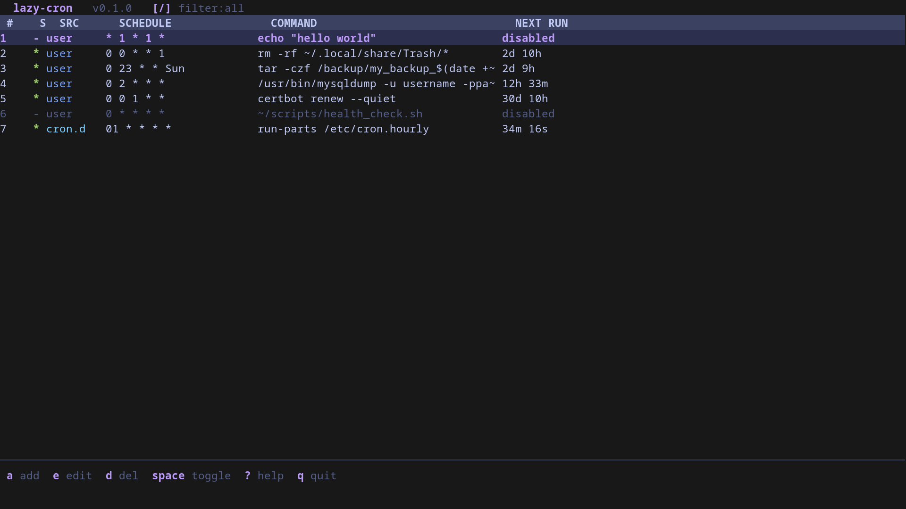
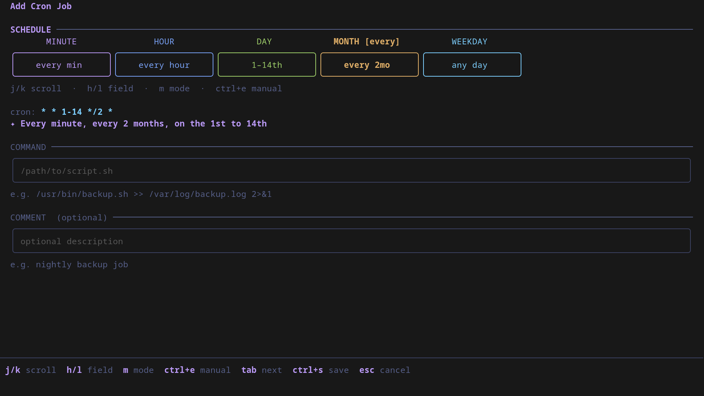
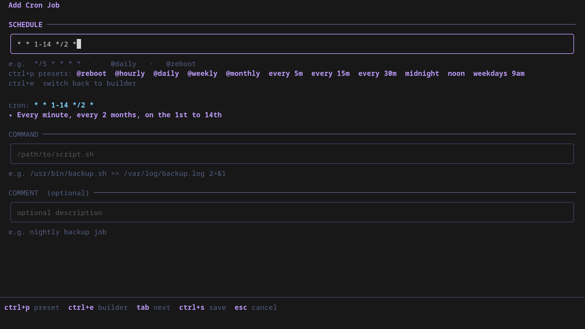

<div align="center">


--- 

# lazy-cron

**A fast, keyboard-driven terminal UI for managing cron jobs on Linux.**

[](https://goreportcard.com/report/github.com/domenez-dev/lazy-cron)
[](LICENSE)
[](https://github.com/domenez-dev/lazy-cron/releases/latest)
[](https://aur.archlinux.org/packages/lazy-cron)



</div>

---

## Why lazy-cron?

Cron syntax is powerful but unintuitive. You shouldn't need to memorize that `0 9 * * 1-5` means "weekdays at 9am" or google what the fifth field does. **lazy-cron** gives you a visual, interactive scheduler right in your terminal — with live human-readable descriptions, vim-style navigation, and zero config required.

```
 lazy-cron  v0.1.0   [/] filter:all

 #    S  SRC      SCHEDULE               COMMAND                              NEXT RUN
 1    *  user     */5 * * * *            /usr/bin/backup.sh                   3m 12s
 2    *  user     @daily                 /home/user/cleanup.sh                18h 4m
 3    -  user     0 12 * * *             /usr/bin/notify.sh                   disabled
 4    *  system   17 *  * * *            cd / && run-parts --report ...       43m 0s

 a add  e edit  d del  space toggle  ? help  q quit
```

## Screenshots:




---

## Features

**Job management**
- List all cron jobs: user crontab + `/etc/crontab` + `/etc/cron.d/*`
- Add, edit, delete user cron jobs
- Enable/disable individual jobs with a single keypress
- Shows next scheduled run time for every job

**Visual schedule builder**
- Five interactive columns: MINUTE, HOUR, DAY, MONTH, WEEKDAY — each color-coded
- Four modes per field: `all` (`*`), `every` (`*/n`), `at` (specific value), `range` (`n-m`)
- Press `m` to cycle modes, `j/k` to scroll values, `h/l` to move between fields
- Live human-readable description: *"At 09:30, on weekdays (Mon-Fri)"*

**Raw mode**
- Toggle between visual builder and raw text input with `ctrl+e`
- Schedule presets in both modes with `ctrl+p`

**Navigation**
- Vim-style keys throughout (`j/k`, `g/G`, `h/l`)
- Filter by source or status: all, user, system, enabled, disabled

---

## Installation

### One-liner (recommended)

Works on Arch, Debian, Ubuntu, Fedora, RHEL, and any Linux distro. Auto-detects your system and installs the right package format.

```bash
bash -c "$(curl -fsSL https://raw.githubusercontent.com/domenez-dev/lazy-cron/main/install.sh)"
```

### Arch Linux (AUR) (Soon..)


### Download a package manually

Grab the latest `.deb`, `.rpm`, or binary archive from the [releases page](https://github.com/domenez-dev/lazy-cron/releases).

```bash
# Debian / Ubuntu
sudo dpkg -i lazy-cron_*.deb

# Fedora / RHEL / CentOS / openSUSE
sudo rpm -i lazy-cron-*.rpm
```

### From source

Requires Go 1.21+.

```bash
git clone https://github.com/domenez-dev/lazy-cron.git
cd lazy-cron
make install    # builds and installs to /usr/local/bin
```

---

## Usage

```bash
lazy-cron
```

Run with `sudo` to also edit system cron jobs in `/etc/crontab` and `/etc/cron.d/`:

```bash
sudo lazy-cron
```

---

## Keybindings

### Main list

| Key | Action |
|-----|--------|
| `j` / `k` | Move down / up |
| `g` / `G` | Jump to top / bottom |
| `a` | Add new cron job |
| `e` | Edit selected job |
| `d` | Delete selected job |
| `space` / `t` | Toggle enable/disable |
| `r` | Reload from disk |
| `/` | Cycle filter |
| `?` | Toggle help panel |
| `q` | Quit |

### Schedule builder

| Key | Action |
|-----|--------|
| `h` / `l` or `←` / `→` | Previous / next field |
| `j` / `k` or `↓` / `↑` | Scroll options in current field |
| `m` | Cycle mode (all, every, at, range) |
| `ctrl+e` | Toggle raw text input |
| `ctrl+p` | Cycle schedule presets |
| `tab` | Jump to command field |
| `ctrl+s` | Save |
| `esc` | Cancel |

---

## Schedule description examples

| Expression | Description |
|---|---|
| `*/5 * * * *` | Every 5 minutes |
| `0 10 * * *` | At 10:00 |
| `0 0 * * *` | At midnight (00:00) |
| `30 9 * * 5` | At 09:30, on Fridays |
| `0 9-17 * * 1-5` | From 09:00 to 17:00, on weekdays (Mon-Fri) |
| `0 0 * 1 *` | At midnight (00:00), in January |
| `@reboot` | At system startup |
| `@daily` | Once a day at midnight |

---

## Notes

- Only **user cron jobs** can be added/edited/deleted without root.
- System jobs in `/etc/crontab` and `/etc/cron.d/` are read-only unless you run with `sudo`.
- Writes go through `crontab -l` / `crontab -`, so existing comments, env vars, and formatting are preserved.

---

## Contributing

See [CONTRIBUTING.md](CONTRIBUTING.md).

---

## License

[MIT](LICENSE) — Copyright (c) 2024 domenez-dev
